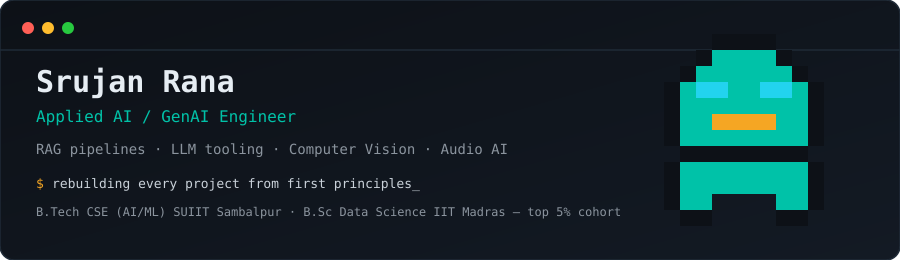
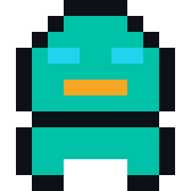

<div align="center">
  
</div>

<!-- <div align="center">

[](https://linkedin.com/in/srujan-rana)
[](https://medium.com/@srujanrana07)
[](https://twitter.com/srujan_rana)
[](mailto:ranasrujan@gmail.com)

</div> -->


I build applied AI systems end-to-end from computer vision pipelines to RAG architectures  and I hold my own work to a first-principles standard. Every project below has been rebuilt from scratch once I could explain every layer of it, not just the API calls.

```
role      → Applied AI / GenAI Engineer
focus     → RAG pipelines · LLM tooling · Computer Vision · Audio AI
currently → rebuilding portfolio projects from first principles
studying  → Karpathy's "Neural Networks: Zero to Hero" for theory depth
based in  → Bhubaneswar, Odisha, India
```

<br>

## Contributions

<table>
<tr>
<td width="60%">

**Merged pull requests to production open-source codebases:**

| Repo | PR | Description |
|---|---|---|
|  `microsoft/qlib` | [#2195](https://github.com/microsoft/qlib/pull/2195) | Merged fix to Microsoft's AI-oriented quant investment platform |
| 🌐 `lingodotdev/lingo.dev` | [#1491](https://github.com/lingodotdev/lingo.dev/pull/1491) | Merged fix to Lingo.dev's open-source localization engine |
| 🤖 `mistralai/mistral-vibe` | [#715](https://github.com/mistralai/mistral-vibe/pull/715) | Retry-loop fix for a reasoning-model agent hang; added 10 new tests |

</td>
<td width="40%" align="center">



</td>
</tr>
</table>

**Also:**
- Diagnosed and documented a floating-point precision bug in `optuna`'s `IntDistribution._contains`
- Global rank **3,119** — Amazon ML Challenge 2025

<br>

## Projects

| Project | Description |
|---|---|
| **Kolam Generator** | Classical CV pipeline converting images into symmetry-verified, South Indian Kolam-style SVG art — FastAPI backend, CLI, Docker, terminal-aesthetic frontend |
| **CNN–BiLSTM Voice Stress Detection** | Research internship (NIT Raipur) — CNN acoustic feature extraction feeding a BiLSTM for temporal stress modeling |
| **PolicyRAG / FakeFi / CropWise** | RAG policy Q&A, financial misinformation detection, and agri-advisory tooling — mid-rebuild for defensible, interview-ready understanding |

<br>
<!-- 
## Stack

<p align="center">
  
</p>

<br>

## GitHub Activity -->

<!-- <div align="center">
  
  
</div> -->

<div align="center">
  
</div>

<br>

<div align="center">
<sub>ranasrujan@gmail.com</sub>
</div>
